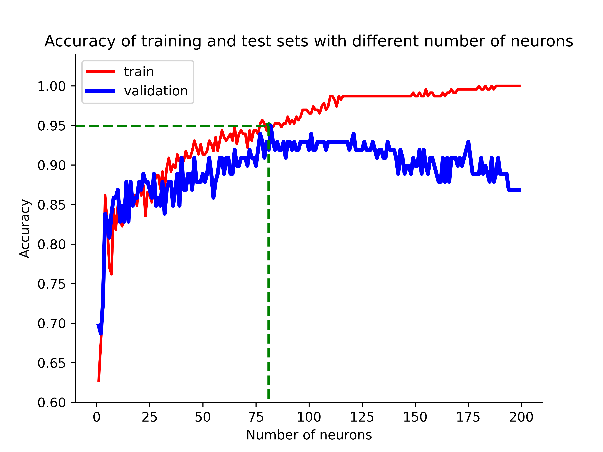

# EE7207 Assignment I

Chen Tairan [TCHEN008@e.ntu.edu.sg](tchen008@e.ntu.edu.sg)
Source code: [https://github.com/chentairan/EE7207](https://github.com/chentairan/EE7207)

---

### Abstract

This report shows the training and prediction results of two different learning models, RBF neural network (RBF-NN) and SVM with a given dataset. In the RBF-NN, experiments are performed in different center selections **(*i.e.* Random, SOM, and K-Means methods)** and various numbers of hidden layer neurons to find better trade-off accuracy between training and validation sets. In the SVM, the hyper-parameters are experimentally found by varying the penalty factor C and the gamma of the Gaussian kernel by **Grid Search**. The experimental results of RBF-NN and SVM are compared and discussed. Finally, the prediction results in the test set are given separately.

## I. Dataset Preparation

 The raw training dataset contains 330 samples. To evaluate the generalizability of these models, I randomly split **30%** of the dataset as the **validation set.** The remaining data is used as the training set for the model training. 

**Note that**: To exclude factors of different data distribution when training different models, the training and validation sets are only randomly selected once and apply to all models.

## II. RBF neural network

This section focuses on two main factors that affect the performance of the RBF-NN: **center selection** and **the number of hidden layer neurons**. I try three strategies of center selection mentioned in the lecture and to change the number of hidden layer neurons in RBF-NN, respectively.

RBF-NN maps the input vector to the hidden space by nonlinear function like Gaussian function. Matrix **$ \Phi $** is calculated by *Equation (2.1)*. After that, in the training process, the output layer weights $\mathbf{w}$ are obtained  by linear least square shown in *Equation (2.2)*.
$$
\Phi_{j} = e^{-\frac{\Vert \mathbf{x(k)} - \mathbf{c}_{j}\Vert^2}{2 \sigma^2}}
\tag{2.1}
$$

$$
\mathbf{w} = (\mathbf{\Phi}^T\mathbf{\Phi})^{-1}\mathbf{\Phi}^{T}\mathbf{d}
\tag{2.2}
$$
where vector $\mathbf{c_j}$ is one of the RBF-NN centers, vector $\mathbf{d}$ is training data labels and scalar $\sigma = \frac{max\_distance\_between\_centers}{\sqrt{2\times center\_number}}$  as mentioned in lecture.

I implement RBF-NN code based on ***numpy***, the detail source code is here: [https://github.com/chentairan/EE7207/blob/master/model/RBFN.py](https://github.com/chentairan/EE7207/blob/master/model/RBFN.py)

### A. *Random* selection of centers

The easiest strategy to select RBF-NN centers is random selection. By randomly selecting the samples from the training set as the centers, the weights can be calculated by *Equation (2.2)*.

In RBF-NN, finding representative centers can effectively improve the incentive of the data. This is because the Gaussian function value gradually decreases from the center to the periphery. Therefore, in *Part B* and *Part C*, two unsupervised learning methods are used to find representatives in the training data.

### B. Select centers using *Self-organization map* method

In this selection strategy, centers are carefully winning from **competitive learning**. With a two-dimensional ($W \times H$) network layer, each time randomly selected samples by calculating the distance to get the winning neurons and updated by Gaussian function. Finally it will generate  $W \times H$  of data representatives, *i.e.* the centers of RBF-NN.

The SOM code is also implemented based on ***numpy***, and the source code can be found here: [https://github.com/chentairan/EE7207/blob/master/model/SOM.py](https://github.com/chentairan/EE7207/blob/master/model/SOM.py)

### C. Select centers using *K-means* method

K-means method randomly selects the initialized *k* samples as the initial clustering centers. Each sample in the dataset calculates its distance to the *k* cluster centers and assign it to the class corresponding to the cluster center with the smallest distance. For each class, recalculate its cluster center. After many iterations, it will find the final *k* data centers.

The K-means method has a good implementation in *sklearn.cluster*, I call the function and get *k* centers from training data.

### D. Number of hidden layer neurons selection

More number of neurons can have a stronger representation of the hidden space. That is because there are more dimensions to express rich feature information. However, more neurons can also lead to overfitting the training data, resulting in poorer results on the test and validation sets. I find a suitable number of neurons by analyzing the accuracy of the validation and training sets.

## III. SVM

Two main parameters are considered in SVM, the penalty coefficient $C$ of the slack variable and the $gamma$ of the RBF kernel function.

By increasing the penalty on the slack variable, it will make it close to 0, i.e., the penalty on misclassification increases, tending to the case of full split pairs for the training set, which will result in a high accuracy rate when the training set is tested, but weak generalization ability, which can easily lead to overfitting.

The larger $gamma$, the smaller the $\sigma$, making the Gaussian distribution tall and thin, causing the model to act only near the support vector, which may lead to overfitting; conversely, the smaller the $gamma$, the larger the $\sigma$, the Gaussian distribution will be too smooth, which will not classify well on the training set and may lead to underfitting. 

### A. Grid Search

In this report, the grid search method is used to tune the hyperparameters $C$ and $gamma$ to achieve better prediction results in the training and validation sets. **K-Fold Cross-validation** is also used to reduce the chance of data division.

### B. Implementation

There is a good implementation of SVM in the sklearn library. I just call functions from this library and implement grid search. The source code can be found here: [https://github.com/chentairan/EE7207/blob/master/model/SVM.py](https://github.com/chentairan/EE7207/blob/master/model/SVM.py)

## IV. Experiments

### A. RBF neural network

In the first part, I test the effect of different center selection methods on RBF-NN. I selected **50 hidden layer neurons** and compared their accuracy on the training and test sets. The results are shown in *Table 4.1*.

<center>Table 4.1 different center selection methods accuracy</center>

|                | Random | K-Means |  SOM   |
| :------------: | :----: | :-----: | :----: |
|  Training set  | 84.85% | 91.77%  | 89.61% |
| Validation set | 82.83% | 87.88%  | 84.85% |

It can be analyzed that K-means and SOM have better accuracy performance compared to random selection. This is because selecting more representative data as the center allows for effective classification of the data.

I also tried to increase the number of randomly selected hidden layer neurons. The results show that the accuracy can only be similar to K-means and SOM methods when **more than 90 neurons** are randomly selected. It can be analyzed that to achieve the same accuracy as K-Means or SOM, and the random selection method needs to spend more neurons.

In the second part, I test the effect of increasing the number of neurons in the hidden layer on the accuracy of the training and validation sets for *RBF-KMeans*. The results are shown in *Figure 4.1*.



<center>Figure 4.1 Accuracy of training and test sets with different number of neurons</center>

The results show that the accuracy of the training set increases with the number of neurons, while the validation set reaches the maximum accuracy 94.8% at 81 neurons and then starts to decrease slowly, which means the model has been overfitted.

### B. SVM

In SVM, I use the grid search strategy to search for C and gamma parameters. Use RBF kernel in SVM and set the search parameter candidates: 

```python
{"gamma": [0.001, 0.01, 0.1, 1, 10, 100],
 "C": [0.001, 0.01, 0.1, 1, 10, 100]}
```

I apply 5-fold cross-validation finding that `gamma=0.1` and `C=10` achieve the best performance in training and validation sets, as shown in Table 4.2.

<center>Table 4.2 SVM accuracy</center>

|                | SVM ( gamma=0.1, C=10 ) |
| :------------: | :---------------------: |
|  Training set  |          98.7%          |
| Validation set |          97.0%          |

### C. Comparison and discussion

From the experimental results shown in Section IV-A, B, SVM has better performance for small training data samples, while RBF is not as accurate as SVM , as shown in *Table 4.3*.

<center>Table 4.3 Comparison of SVM and RBF-NN accuracy</center>

|                | RBF-NN<br>(K-Means with 81 hidden neurons) | SVM <br>(gamma = 0.1, C= 10) |
| -------------- | :----------------------------------------: | :--------------------------: |
| Training set   |                   94.9%                    |            98.7%             |
| Validation set |                   94.8%                    |            97.0%             |

RBF-NN does not have precise rules to fix the number of neurons in hidden layers and center selection, which presents a major concern for obtaining an optimal architecture. On the contrary, the final decision function of SVM is determined by only a few support vectors, which helps us to capture the key samples and eliminate a large number of redundant samples. Therefore, this method is not only simple but also has good robustness.

## V. Test set Results

Finally the prediction results of *SVM* and *RBF-NN* in the test dataset are given:

```python
svm_testset_predict = [1 -1  1 -1  1 -1  1 -1  1 -1  1 -1  1  1  1 -1  1 -1  1 -1  1]

rbf_testset_predict = [1 -1  1  1  1 -1  1 -1  1 -1  1  1  1  1  1 -1  1 -1  1  1  1]
```


